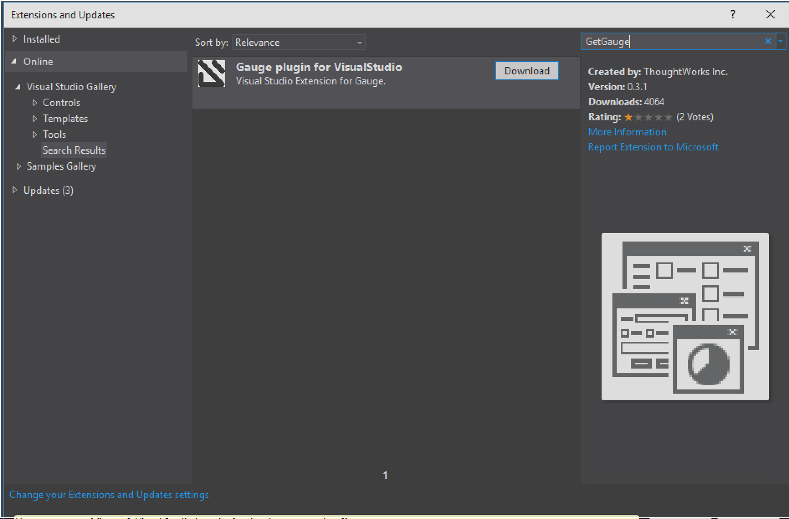
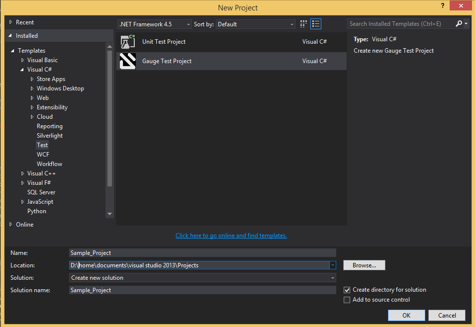
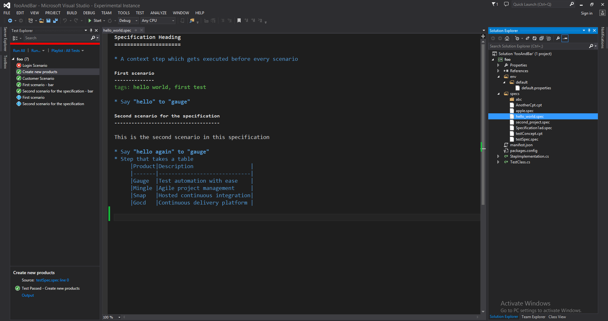
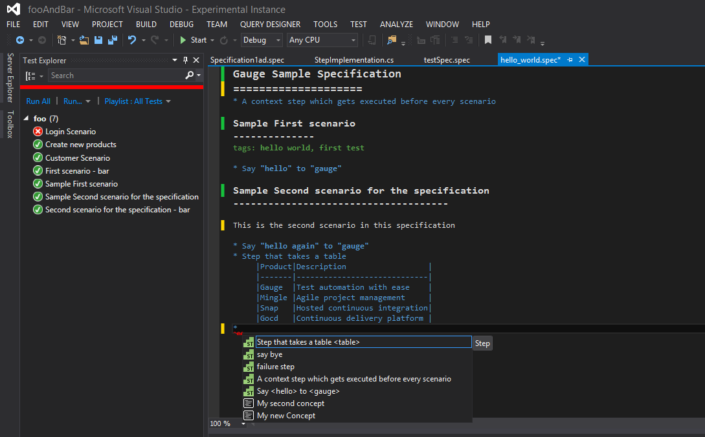
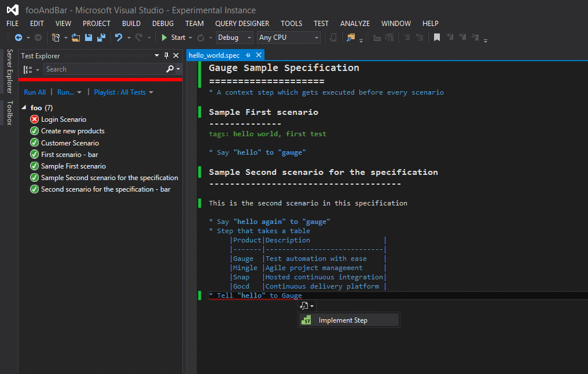
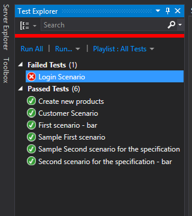
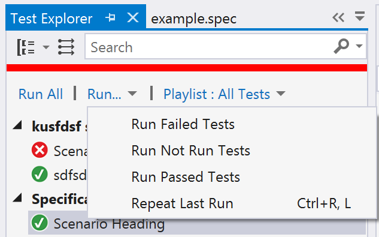
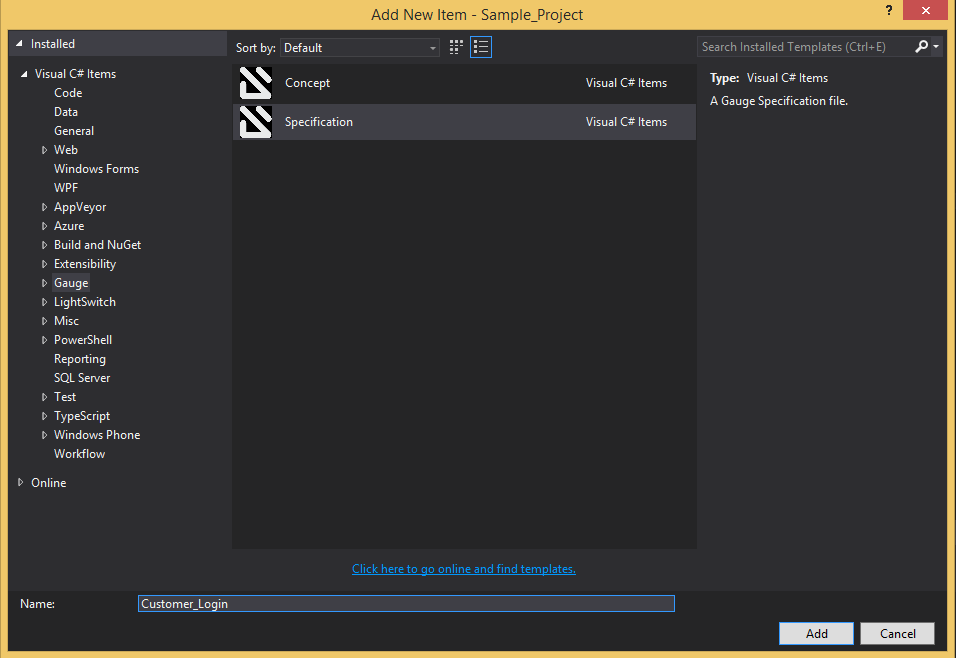

# Gauge.VisualStudio
Visual Studio plugin for Gauge - wires up Visual Studio features to Gauge.

[](https://ci.appveyor.com/project/getgauge/gauge-visualstudio)
 
[](CODE_OF_CONDUCT.md)

## Deprecation Notice
*[VS Code](https://code.visualstudio.com/) has good support for .Net Core and the [Gauge VS Code](https://github.com/getgauge/gauge-vscode/) works great with the [Gauge dotnet plugin](https://github.com/getgauge/gauge-dotnet). We are deprecating the Visual Studio Gauge plugin in favour of the [Gauge VS Code plugin](https://github.com/getgauge/gauge-vscode/).*

*The Gauge team will stop addding new features to the Visual Studio Gauge plugin, only bug fixes will be done henceforth. The Gauge team will officially end support for Visual Studio Gauge plugin in October 2020.*

## Installation

-  Open Visual Studio Extension Manager from `Tools` ->
   `Extensions and Updates`.
-  Go to `Visual Studio Gallery` and search for `Gauge VS2013`.
-  Click on `Download` and select `Install` option.
-  Restart Visual Studio in order for the changes to take effect.

The extension resides on the [Visual Studio Marketplace](https://marketplace.visualstudio.com/items?itemName=vs-publisher-1071478.GaugepluginforVisualStudio)




## Creating a new Gauge Project


###  Install project and item templates from Visual Studio Marketplace

-  Download the templates from [Visual Studio Marketplace](https://marketplace.visualstudio.com/items?itemName=vs-publisher-1071478.gauge-visualstudio-templates).
-  Install the Gauge VisualStudio Templates - vsix

### Create Gauge Project

-  Go to ``File`` -> ``New Project``.
-  Choose ``Gauge Test Project`` under Visual C# Test category.



-  Choose the Project location and Project Name.
-  Click ``OK``.

This should setup a new Gauge project, and add the required meta data
for Gauge to execute this project.

Alternately, you can create a Gauge project from command-line as:

```cmd
    mkdir <project_name>
    cd <project_name>
    gauge init csharp
```

This creates `<project_name>.sln` file which can be opened with Visual
Studio.

## Syntax Highlighting


Gauge specs are in [Markdown](https://daringfireball.net/projects/markdown/syntax)
syntax. This plugin highlights Specifications, Scenarios, Steps and
Tags.

Steps with missing implementation are also highlighted.



## Auto Completion

This plugin hooks into VisualStudio Intellisense, and brings in
autocompletion of Step text. The step texts brought in is a union of
steps already defined, concepts defined, and step text from
implementation.

**Hint:** *Hit `Ctrl + Space` to bring up the Intellisense menu.*



## Implement Step

If you have an unimplemented step in the spec file, it will be get highlighted with a red underline.
Hover over towards the end of step text to get the Smart Tag to implement it.
On clicking the Smart Tag a pop up opens. The destination of the implementation can be chosen, either
a new class or from a list of existing classes. It will then generate
the step with required annotation and parameters.



## Navigation

Jump from Step text to it's implementation.

Usage: `Right Click` -> `Go to Declaration` or hit F12

## Formatting


A specification file can be formatted easily using `Right Click` -> `Format File`
Or use the command: `Ctrl+K, Ctrl+D`

This formats the specification including indentation of tables and
steps.

## Execution with Test Explorer


**note**:
    Refer [MSDN Documentation on Unit Test Explorer](https://msdn.microsoft.com/en-us/library/hh270865.aspx#Anchor_2)` for all features of Unit Test Explorer.


When you build the test project, all the test scenarios appear in Test Explorer.
If Test Explorer is not visible, choose Test on the Visual Studio menu, choose Windows, and then choose Test Explorer.



### Run tests

* To run all the scenarios in a solution, choose Run All.
* To run all the scenarios of a specification, choose Run... and then choose the group on the menu.
* To run one or more scenarios, select the individual scenarios that you want to run, open the context menu for a selected scenario and then choose Run Selected Tests.

### Run tests in parallel

If individual scenarios have no dependencies that prevent them from being run in any order,
turn on parallel test execution with the |ute_parallel| toggle button on the toolbar.

If you want to use the parallel run of Gauge refer the [command line parallel execution](https://docs.gauge.org/using.html#parallel-execution).

### Test results

The pass/fail bar at the top of the Test Explorer window is animated as the scenarios run.
At the conclusion of the run, the pass/fail bar turns green if all tests passed or turns red if any test failed.

As you run, write, and rerun your tests, Test Explorer displays the results in default groups of Failed Tests,
Passed Tests, Skipped Tests and Not Run Tests. You can change the way Test Explorer groups your tests.
You can perform much of the work of finding, organizing and running tests from the Test Explorer toolbar.




### Traits

Groups of scenarios by specification, tags that are defined.

### Search and filter the test list

This Test Explorer feature can be used as mentioned in [Search and filter the test list](https://msdn.microsoft.com/en-us/library/hh270865.aspx#BKMK_Search_and_filter_the_test_list) of Visual Studio documentation.

### Debugging


Debugging can be performed the same way spec execution works.

`Right click` -> `Debug Selected Tests` on a scenario(s) in the Test explorer. Execution
will halt on marked [breakpoints](https://docs.microsoft.com/en-us/visualstudio/debugger/using-breakpoints).

## Rephrase Steps


-  `right click` -> `Rename` on a step to rephrase it.
-  The parameters can also be reordered,removed or new parameters can be
   added.
-  The rephrase change will reflect across **all the specs** in the
   project.

## Find Usages

-  Right click on a step -> Find All References

## Create Spec and Concept files

-  You can right-click on `specs` directory or any nested directory,
   choose `Add` -> `New Item` -> Go to `Gauge` under
   `Visual C# Items`.
-  Choose `Specification` or `Concept` file type.
-  Enter file name and click `Add`.



## Development Environment Setup
Refer [here](https://github.com/getgauge/gauge-visualstudio/wiki) for development setup.

## License

Gauge.VisualStudio is released under [Apache License 2.0](https://www.apache.org/licenses/LICENSE-2.0)

## Copyright

Copyright - 2014, 2015 ThoughtWorks Inc.
